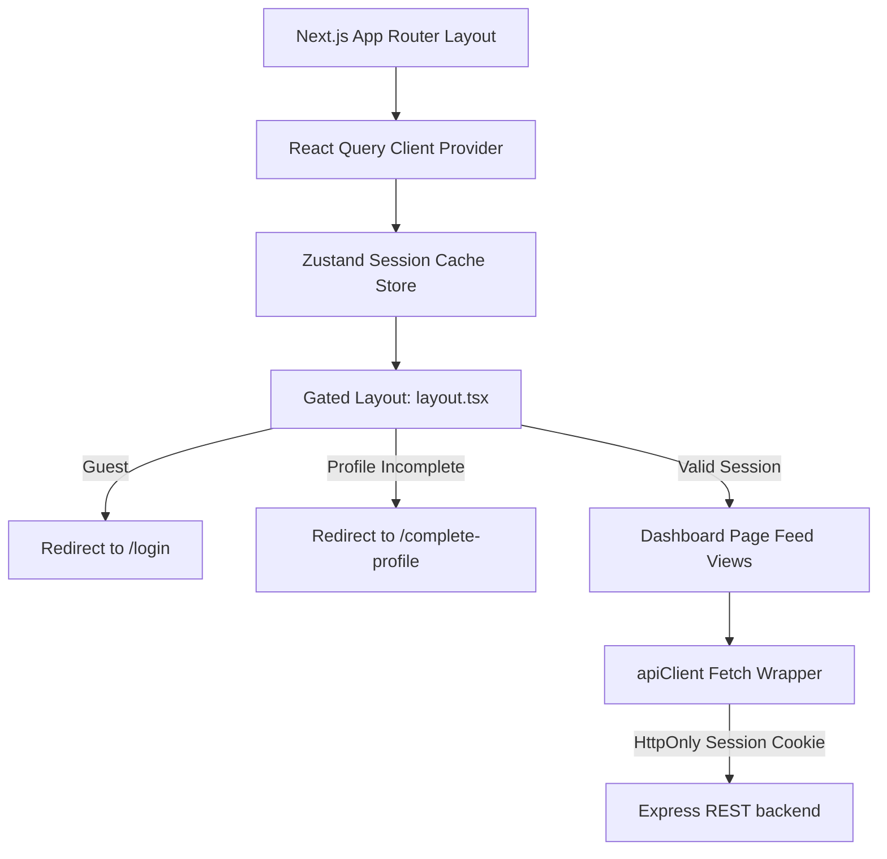

# Code to Career (C2C) Frontend Documentation

Welcome to the frontend codebase for the **Code to Career (C2C)** student platform. This application is a high-performance web dashboard built using **Next.js (App Router), React 19, TypeScript, Tailwind CSS v4, and shadcn/ui**. It integrates with an Express/PostgreSQL/Prisma backend to coordinate coding contests, hackathons, ranking lists, calendar events, and discussion boards.

---

## 1. Project Overview & Purpose

The C2C frontend serves as a premium portal for engineering students to:
- Participate in competitive coding contests integrated directly with HackerRank.
- Build and join collaborative squads for student hackathons.
- View real-time leaderboard rankings filtered by class target years.
- Track calendar timelines showing upcoming sessions, hackathons, and bootcamps.
- Share interview tips and academic summaries inside a markdown-supported discussion board.

The design system follows a modern, dark-first premium aesthetic inspired by Linear, Vercel, and GitHub, utilizing crisp transparent cards, glassmorphic navigations, micro-interactions, and glowing accent borders.

---

## 2. Implemented Features & Capabilities

- **Stateful Authentication Gateways**: Checks sessions and checks profile completion. Redirects unauthenticated traffic to `/login` and profile-incomplete traffic to `/complete-profile`.
- **HackerRank Contests Catalog**: Lists active, upcoming, and past programming events. Active locked items require entering access codes in dialog modals before revealing URL directions.
- **Role-Based Hackathon Portals**:
  - *Members*: Register for arenas, create teams to generate join codes, or join friend squads by entering 6-character codes.
  - *Admins/Seniors*: View list of registered squads, invite passcodes, and member rosters.
- **Dynamic Leaderboard**: Fetches rankings from HackerRank score syncs. Highlights the active student's card row in Coral accent.
- **Chronological Timeline**: Vertical timeline mapping all student events (Sessions, Contests, Camps) with custom Lucide icon badges and target year filters.
- **Markdown Discussion Forum**:
  - *Feeds*: Search query boxes with debounced inputs and topic tags filter selectors.
  - *Editor*: Custom upload input requesting backend signatures to upload images directly to Cloudinary; textarea supports headers, codes, quotes, and list styles.
  - *Threads*: Nested comment timelines with options for admins or authors to delete posts and replies.

---

## 3. Technology Stack & Rationale

| Dependency | Purpose | Rationale |
| :--- | :--- | :--- |
| **Next.js 16 (App Router)** | Base Framework | File-based routing, layout inheritance, and automatic route prefetching/optimizations. |
| **TypeScript** | Type Safety | Strong models prevention of runtime attribute faults across API response envelopes. |
| **TanStack Query v5** | Server State Caching | Handles caching, loading/error states, mutations, and optimistic upvote updates. |
| **Zustand v5** | Client State Store | Minimal store to cache authentication profile states without context rerender penalties. |
| **React Hook Form & Zod** | Form Validation | Lightweight client-side form controls and schema validations (e.g. Indian mobile number regex). |
| **Tailwind CSS v4 & PostCSS** | UI Styling | High-performance CSS compiling, custom OKLCH color palettes, and container utility helpers. |
| **Lucide React** | Icons Asset | Large set of crisp vector icons. |

---

## 4. Frontend Architecture

The system uses a **decoupled client-rendering architecture** backed by Next.js client-side page configurations (`'use-client'`). Layout security gates intercept routing lifecycle hooks. Communication with the Express backend is mediated through a wrapper that validates JSON envelopes, manages cookie-based authorization headers, and raises customized `ApiError` objects.



---

## 5. Directory & File Structure

```
/frontend
├── public/                     # Public asset templates (logos, fallbacks)
├── src/
│   ├── app/                    # Routing routes and layouts (App Router)
│   │   ├── (auth)/             # Route Group: Authenticated gateway pages
│   │   │   └── login/
│   │   │       └── page.tsx    # Glassmorphic Login card
│   │   ├── (dashboard)/        # Route Group: G gated panel subroutes
│   │   │   ├── layout.tsx      # Main layout guard (Desktop sidebar / mobile sheets)
│   │   │   ├── calendar/
│   │   │   │   └── page.tsx    # Event Timeline stream page
│   │   │   ├── contests/
│   │   │   │   └── page.tsx    # Contests list & lock dialog modal
│   │   │   ├── forum/
│   │   │   │   ├── page.tsx    # Forum Feed with tags filter
│   │   │   │   ├── new/
│   │   │   │   │   └── page.tsx# Markdown post editor and Cloudinary hook
│   │   │   │   └── [id]/
│   │   │   │       └── page.tsx# Forum thread and comments section
│   │   │   ├── hackathons/
│   │   │   │   ├── page.tsx    # Hackathons listings catalog
│   │   │   │   └── [id]/
│   │   │   │       └── page.tsx# Squad management (dynamic roles tab panels)
│   │   │   ├── leaderboard/
│   │   │   │   └── page.tsx    # Year-wise standings rankings
│   │   │   └── page.tsx        # Dashboard home panels
│   │   ├── complete-profile/   # Profile creation gate page
│   │   │   └── page.tsx        # Validated phone & hackerrank inputs form
│   │   ├── globals.css         # Tailwind variables (OKLCH themes)
│   │   ├── layout.tsx          # Root provider context (Tanstack Query, Theme)
│   │   └── loading.tsx         # Fullscreen visual loader component
│   ├── components/             # Reusable UI component modules
│   │   ├── ui/                 # shadcn/ui primitives
│   │   │   ├── button.tsx      # Base-UI custom rendering controls
│   │   │   ├── dialog.tsx      # Modal panels overlay
│   │   │   ├── input.tsx       # Text fields inputs
│   │   │   ├── textarea.tsx    # Multiline text blocks
│   │   │   └── skeleton.tsx    # Loading block outlines
│   │   └── shared/             # Site structure wrappers
│   │       └── markdown.tsx    # Custom Markdown formatting components
│   ├── hooks/                  # Reuse logic hooks
│   │   ├── use-auth.ts         # User session check hooks
│   │   ├── use-debounce.ts     # Input rate-limit triggers hook
│   │   └── use-upload.ts       # Cloudinary direct transfer hook
│   ├── lib/                    # Configuration layers
│   │   ├── api-client.ts       # Enforced Fetch wrapper
│   │   └── utils.ts            # Tailwind merging help (cn)
│   ├── services/               # Explicit backend API endpoints mapping
│   │   ├── auth.ts             # Sign in, profile completions, logout
│   │   ├── calendar.ts         # Query scheduling endpoints
│   │   ├── contests.ts         # Fetch and unlock coding tests
│   │   ├── forum.ts            # Feed query, details, upvotes, and comments
│   │   ├── hackathons.ts       # Arenas details, squad creation & joining
│   │   └── leaderboard.ts      # Class ranking metrics queries
│   ├── store/                  # Client states
│   │   └── auth-store.ts       # Global session cache store
│   └── types/                  # Static TS Interfaces
│       ├── api.ts              # Response envelop layout
│       └── models.ts           # DB schema representations (User, Post, Team)
├── package.json                # Project script mappings and packages
└── tsconfig.json               # compiler properties configurations
```

---

## 6. Routing Structure & Gating Hierarchy

The application layout uses Next.js Route Groups `(auth)` and `(dashboard)` to partition gated views:

1. **Root Gating Layout (`app/(dashboard)/layout.tsx`)**:
   Every nested route within the dashboard checks session authenticity:
   - If user query is in progress $\rightarrow$ shows full screen splash loader.
   - If user query returns unauthorized error (`401`) $\rightarrow$ routes directly to `/login`.
   - If user query succeeds but `isProfileComplete === false` $\rightarrow$ routes directly to `/complete-profile`.
2. **Profile Completion Gate (`app/complete-profile/page.tsx`)**:
   - If the user has completed profile details, redirects them back to `/dashboard` to block double-submissions.

---

## 7. State Management & Data Flow

C2C separates state into two categories:

- **Server-State (React Query)**:
  - Cache entries are managed under custom query keys (e.g. `['forum-posts', tag]`, `['hackathon', id]`).
  - Automatically queries, updates loader flags (`isLoading`), updates error objects (`error`), and cache expirations (`staleTime`).
  - Mutation handlers invalidate matching caches to force refresh feeds:
    ```typescript
    const queryClient = useQueryClient();
    queryClient.invalidateQueries({ queryKey: ['forum-posts'] });
    ```
- **Client-State (Zustand)**:
  - Stores credentials and session status:
    ```typescript
    interface AuthState {
      user: User | null;
      isAuthenticated: boolean;
      setUser: (user: User | null) => void;
      logout: () => void;
    }
    ```
  - Located in [auth-store.ts](file:///c:/Users/sawna/OneDrive/Documents/Development/My_Projects/c2c-website/frontend/src/store/auth-store.ts).

---

## 8. API Integration Strategy

Communication is processed via the custom fetch utility in [api-client.ts](file:///c:/Users/sawna/OneDrive/Documents/Development/My_Projects/c2c-website/frontend/src/lib/api-client.ts).

### Key Constraints:
- **Session Cookies**: Automatically attaches `{ credentials: 'include' }` to transmit HttpOnly session keys.
- **Envelope Unwrapping**: Resolves backend `ApiResponse<T>` wrappers to return pure `T` data blocks:
  ```typescript
  export interface ApiResponse<T> {
    success: boolean;
    data: T;
    message?: string;
  }
  ```
- **Error Propagation**: Detects `success: false` envelopes or non-2xx statuses, raising custom `ApiError` containing backend error messages.

---

## 9. Authentication Flow

C2C utilizes secure, server-managed HttpOnly sessions.

1. **Login Action**: Clicking "Sign In with Google" redirects the browser to `${API_BASE_URL}/api/auth/google`.
2. **OAuth Callback**: The backend handles identity verification, writes an HttpOnly session cookie to the browser domain, and redirects back to `/dashboard`.
3. **Session Sync**: On app load, `useAuth` fetches `/api/auth/me`. Upon receiving profile details, it writes details into the Zustand cache.
4. **Logout Action**: Clicking "Log Out" triggers `/api/auth/logout`, clearing browser cookies and calling `useAuthStore.getState().logout()`.

---

## 10. Environment Variables

Create a `.env.local` file in `/frontend`:

```env
# URL target of the backend Express service
NEXT_PUBLIC_API_URL=http://localhost:5000
```

---

## 11. Development Workflow & Guidelines

### Commands:
```bash
# Install dependencies
npm install

# Start local Next.js Turbopack development server
npm run dev

# Compile TypeScript and generate optimized production bundle
npm run build

# Start production server
npm run start

# Run ESLint validation checks
npm run lint
```

### Component Guidelines:
- Keep components focused and reusable.
- Put UI primitives inside `src/components/ui/` (managed by shadcn CLI).
- Inject styles utilizing standard Tailwind CSS utility classes; avoid styling components with ad-hoc values.
- Place resource API queries inside the `src/services/` folder, importing them inside React components using React Query `useQuery`/`useMutation` hooks.

---

## 12. Guide: How to Add New Features

### Adding a Page/Route
1. Create a directory inside `src/app/(dashboard)/` (e.g. `src/app/(dashboard)/announcements`).
2. Add a `page.tsx` file inside. Mark it `'use client'` if it utilizes react hooks.
3. Register the new route in the sidebar layout at `src/components/shared/sidebar.tsx` or `layout.tsx` to enable links.

### Adding an API Service
1. Create a service file under `src/services/` (e.g. `src/services/announcements.ts`).
2. Export async methods utilizing `apiClient<T>` wrapper.
3. Declare matching TS models inside `src/types/models.ts`.

### Adding a Component
1. If adding a UI primitive (e.g. checkbox, badge), install it via shadcn CLI or write it in `src/components/ui/`.
2. If adding a feature component (e.g. `ForumCard`), place it inside `src/components/features/forum/` or `src/app/(dashboard)/forum/components/`.

---

## 13. Styling System (Tailwind v4 & shadcn)

C2C leverages Tailwind CSS v4's custom properties and theme tokens defined in [globals.css](file:///c:/Users/sawna/OneDrive/Documents/Development/My_Projects/c2c-website/frontend/src/app/globals.css):

- **Accents Palette**: OKLCH colors provide highly consistent glowing hues.
  - Brand Primary Accent: `oklch(0.641 0.219 25.3)` (Vibrant Coral-Orange / `#ff5b35`).
  - Dark Surface Base: `oklch(0.12 0.015 250)` (Sleek dark slate black).
- **Core Elements styling**:
  - Borders: `border border-border` combined with transparent cards background `bg-card/45 backdrop-blur-xl`.
  - Input: Native input components use the `.focus-visible:ring-primary` selector to glow in brand colors on focus actions.

---

## 14. Error & Loading Systems

- **Forms validation**: Controlled validation schemas are parsed using `zod` and checked during submissions in React Hook Form. Error messages render below input fields.
- **API Error Indicators**: Errors are caught in query error states (`error`) and shown inside styled alert banners with a warning icon.
- **Skeleton states**: Layout pages render layout outline skeletons (using [skeleton.tsx](file:///c:/Users/sawna/OneDrive/Documents/Development/My_Projects/c2c-website/frontend/src/components/ui/skeleton.tsx)) to reduce perceived load time.

---

## 15. Known Limitations & Future Improvements

- **Real-time Leaderboard Syncing**: HackerRank scores sync at manual backend intervals. Future iterations could add a client-side button for administrators to trigger instant sync actions.
- **Forum Pagination**: The discussion feed queries all active posts. In the future, cursor-based pagination should be added to handle large feeds.
- **Notification systems**: Event changes currently render inside timeline updates. Future enhancements should include user notifications via real-time WebSocket connections or push notifications.
